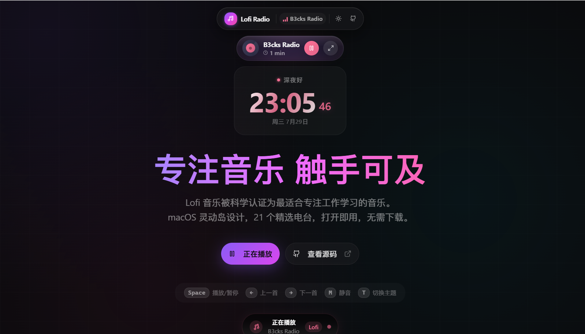

<h1 align="center">🎧 Lofi Radio Web</h1>

<div align="center">

[🌐 简体中文](./README.md) · **English**


**With steady rhythms, minimal vocals, and a relaxed atmosphere, Lofi (Low Fidelity) music is a natural fit for studying, working, and creating.**

Featuring a macOS-style Dynamic Island design and 21 curated stations. Open the site and listen with no account or download required.

**[🎧 Live Experience](https://lofi.88lin.eu.org/)** · [✨ Features](#-features) · [🚀 Quick Start](#-quick-start) · [☁️ Deployment Guide](#-deployment-guide) · [💬 Discussions](https://github.com/88lin/lofi-radio-web/discussions)

</div>

---

## 🖼️ Home Preview

<div align="center">

<a href="https://lofi.88lin.eu.org/">
  
</a>

<sub>Dark mode · Dynamic Island player, live focus clock, and keyboard controls</sub>

</div>

---

## 📖 Project Introduction

Lofi Radio Web is a web-based implementation of [labilio/lofi-radio](https://github.com/labilio/lofi-radio), transforming the original Electron desktop application into a modern Web application.

**It's like bringing the background music of a coffee shop into your study** — no local audio files needed, no need to pick playlists, just open the page and listen.

### 🎯 Design Philosophy

- **Focus Experience**: A compact Dynamic Island player that stays present without getting in the way.
- **Cross-Platform**: A responsive web experience for desktop and mobile devices.
- **Instant Use**: No registration, login, download, or local music library required.
- **PWA Support**: Installable as a standalone window for a more app-like experience.

### 🧠 Why Lofi is Suitable for Focus

Lofi (Low Fidelity) music is often used for high-concentration tasks such as studying, programming, writing, and office work. Its typical characteristics include:

- **Slow and steady tempo** (usually 60-90 BPM)
- **Simple melodies with a strong sense of loop**
- **Minimal or no lyrics**
- **Soft tones**, often accompanied by rain sounds, vinyl crackle, or ambient noise
- **Restrained emotion**, avoiding artificial climaxes

These characteristics can make Lofi a less distracting choice for background listening:

1. **Fewer linguistic interruptions**: Minimal vocals are less likely to interrupt language-heavy work such as reading, writing, or coding.
2. **A predictable listening pattern**: Steady rhythms and loops avoid abrupt changes during longer sessions.
3. **A gentle sense of presence**: Soft textures can fill an overly quiet room without forcing an emotional climax.

> [!NOTE]
> Music affects everyone differently. Choose a sound and volume that suit your task, preferences, and environment.

---

## ✨ Features

### 🎵 Music Playback

| Feature | Description |
|------|------|
| **21 Curated Stations** | Covers various styles including Lofi, Chillhop, Jazz, Classical, Hip-Hop, Ambient, and more |
| **Bilibili Live Sources** | Supports the Lofi Girl Bilibili stream with HLS/FLV candidates and recovery paths |
| **Global Streaming Sources** | Integrates sources like Lofi Cafe, SomaFM, Code Radio, Swiss Classic, etc. |
| **Quick Switching** | Switch stations with one click and automatically load the selected stream |

### 🎨 Interface Design

| Feature | Description |
|------|------|
| **Dynamic Island Player** | macOS-style Dynamic Island design, freely draggable to any position on the screen |
| **Glassmorphism Effect** | Uses blur and layered transparency to keep the interface visually light |
| **Vinyl Animation** | Beautiful rotating vinyl record animation that triggers during playback |
| **Dark/Light Themes** | One-click switching or automatic synchronization with system theme |
| **Responsive Design** | Adapts the experience to desktop and mobile screen sizes |

### ⌨️ Keyboard Shortcuts

| Shortcut | Function |
|--------|------|
| `Space` | Play / Pause |
| `←` | Previous Station |
| `→` | Next Station |
| `M` | Mute / Unmute |
| `T` | Switch Theme (Dark/Light) |

### ⏱️ Focus Timer

- Tracks daily focus duration (only counts while playing)
- Helps cultivate efficient work habits
- Data stored locally, automatically resets daily

### 🌙 Sleep Timer

- Fast presets for 15/30/45/60/90/120 minutes
- Custom duration from 1 to 480 minutes
- Automatically pauses playback when the timer ends
- Sleep timer state supports local persistence

---

## 📻 Station List (21 Total)

### Study (3)

| Station | Genre Tags | Note |
|------|---------|------|
| **Lofi Girl** | Lofi / Chill | Bilibili live source, Bilibili-friendly |
| **Lofi Box** | Lofi / Chill | Classic Lofi stream |
| **Lofi Studying** | Lofi / Study | Specifically for studying scenarios |

### Programming (2)

| Station | Genre Tags | Note |
|------|---------|------|
| **Groove Salad** | Chill / Ambient | Friendly for long coding sessions |
| **Code Radio** | Lofi / Coding | freeCodeCamp programming radio |

### Reading (4)

| Station | Genre Tags | Note |
|------|---------|------|
| **Chill Sky** | Chill / Electro | Light electronic atmosphere |
| **Lofi Japanese** | Japanese / Lofi | Japanese-style Lofi vibes |
| **Jazz Box** | Jazz / Smooth | Smooth jazz stream |
| **B3cks Radio** | Lofi / Relax | Relaxation-oriented Lofi |

### Relaxing (3)

| Station | Genre Tags | Note |
|------|---------|------|
| **Chill Wave** | Chill / Electro | Ambient electronic |
| **Lofi Chilling** | Lofi / Chill | Low-pressure companion background audio |
| **Paradise** | Chill / Alt | Diverse relaxing styles |

### Sleep (4)

| Station | Genre Tags | Note |
|------|---------|------|
| **Rain Sounds** | Ambient / Nature | White noise and nature sounds |
| **Lofi Sleeping** | Lofi / Sleep | Low-stimulus stream for bedtime |
| **Drone Zone** | Ambient / Deep | Deep ambient sound wall |
| **ASP** | Ambient / Sleep | Minimalist sleep atmosphere |

### Focus (1)

| Station | Genre Tags | Note |
|------|---------|------|
| **Swiss Classic** | Classical / Symphony | Classical symphony for focus |

### Others (4)

| Station | Genre Tags | Scenario |
|------|---------|------|
| **Jazz Groove** | Jazz / Groove | Writing |
| **Jazz Smooth** | Jazz / Mellow | Office Work |
| **Rap Beats** | Hip-Hop / Beats | Exercise |
| **Lofi Gaming** | Lofi / Gaming | Entertainment |

> [!NOTE]
> This repository does not host station audio. Third-party streams may become temporarily unavailable because of upstream maintenance, regional restrictions, or network conditions. Try another station if a stream fails.

---

## 🧰 Tech Stack

| Tech | Description |
|------|------|
| [Next.js 16](https://nextjs.org/) | Full-stack React framework, App Router |
| [React 19](https://react.dev/) | UI Library |
| [TypeScript](https://www.typescriptlang.org/) | Type safety |
| [Tailwind CSS v4](https://tailwindcss.com/) | Utility-first CSS |
| [Framer Motion](https://www.framer.com/motion/) | Animation library |
| [Zustand](https://zustand-demo.pmnd.rs/) | Lightweight state management |
| [HLS.js](https://hlsjs.org/) | HLS streaming playback |
| [flv.js](https://github.com/bilibili/flv.js) | Bilibili FLV live stream playback |
| [Lucide Icons](https://lucide.dev/) | Icon library |

---

## 🚀 Quick Start

### Prerequisites

- Node.js `20.9` or higher (required by Next.js 16)
- npm, yarn, pnpm, or bun

> [!TIP]
> The repository includes `package-lock.json`. Use `npm ci` for a reproducible first install or in CI, and use `npm install` when intentionally updating dependencies.

### Local Development

```bash
# Clone the repository
git clone https://github.com/88lin/lofi-radio-web.git
cd lofi-radio-web

# Install locked dependencies
npm ci

# Start development server
npm run dev
```

Open [http://localhost:3000](http://localhost:3000) in your browser.

### Production Build

```bash
# Build the project
npm run build

# Start production server
npm run start
```

---

## ☁️ Deployment Guide

> [!TIP]
> **Before deploying your own copy, fork this repository.**
>
> 1. Visit the [lofi-radio-web](https://github.com/88lin/lofi-radio-web) repository homepage.
> 2. Click the **Fork** button in the top right.
> 3. Once complete, you will see a copy of the `lofi-radio-web` repository under your own GitHub account.
>
> The deployment options below assume that you are using your fork.

### Pre-deployment Checklist

> [!IMPORTANT]
> This project includes server-side APIs and is not a static site. The platform must support the Next.js Node.js server runtime and permit outbound server requests.

The runtime must provide:

- Runtime requirement: Node.js `>= 20.9.0`
- Application type: Standard Next.js server-side application (not a pure static site)
- API dependency: `/api/bilibili-stream` explicitly uses the Node.js runtime
- Outbound access: The deployment environment must allow server-side access to `api.live.bilibili.com` and `api.github.com`

### Deploy to Vercel (Recommended)

[Vercel](https://vercel.com) matches the current repository structure and is the recommended hosting option.

[](https://vercel.com/new/clone?repository-url=https://github.com/88lin/lofi-radio-web)

1. Click the button above, or visit the [Vercel Dashboard](https://vercel.com/dashboard).
2. Import your forked `lofi-radio-web` repository.
3. Keep the default Framework Preset as `Next.js`.
4. Use the default Build Command, or explicitly enter `npm run build`.
5. Use the default Install Command, or explicitly enter `npm install`.
6. Set the Node.js version to `20.x` or higher.
7. Current default public features usually don't require extra environment variables; just click `Deploy`.

If you later enable databases, authentication, or other extensions in your own branch, add the corresponding environment variables then.

### Deploy to Standard Node.js Server (Recommended)

If you use your own Linux server, cloud VM, PaaS, or panel, it is recommended to deploy as a standard Next.js Node service.

```bash
# Install dependencies
npm install

# Build
npm run build

# Start production service
npm run start
```

The default listening port is `3000`. If you need a reverse proxy, you can point Nginx / Caddy directly to this port.

A reference [Caddyfile](./Caddyfile) is included in the repository, suitable for reverse proxying in local or self-hosted scenarios.

### Docker Deployment (Recommended)

A ready-to-use [Dockerfile](./Dockerfile) is provided in the root directory.

```bash
# Build image
docker build -t lofi-radio-web .

# Run container
docker run -d --name lofi-radio-web -p 3000:3000 --restart unless-stopped lofi-radio-web
```

Once the container starts, the application will execute `npm run start` inside the container, exposing port `3000` by default.

### Cloudflare Pages / Netlify / Other Platforms

> [!CAUTION]
> A static export cannot provide this project's server APIs. Before using Cloudflare Pages, Netlify, or another platform, verify its Next.js server adapter, Node.js version, and outbound network policy.

Check these requirements carefully:

- This project contains server-side APIs, not just pure static pages.
- `/api/bilibili-stream` relies on the Node.js runtime and server-side outbound requests.
- Different platforms vary significantly in their support for Next.js server runtime, adapters, Node.js versions, and network policies.

If you are familiar with these platforms, you can validate a custom setup. Otherwise, prefer:

- Vercel
- Standard Node.js Server
- Docker + Reverse Proxy

---

## 🗂️ Project Structure

```
lofi-radio-web/
├── src/
│   ├── app/                      # Next.js App Router
│   │   ├── page.tsx             # Home server shell (emits home JSON-LD)
│   │   ├── layout.tsx           # Root layout (metadata + site-level JSON-LD)
│   │   ├── globals.css          # Global styles
│   │   ├── stations/page.tsx    # Station directory (server-rendered)
│   │   ├── faq/page.tsx         # FAQ (server-rendered)
│   │   ├── about/page.tsx       # About page (server-rendered)
│   │   ├── llms.txt/route.ts    # AI site overview (generated from data)
│   │   ├── llms-full.txt/route.ts # AI full-content file
│   │   ├── pricing.md/route.ts  # Machine-readable pricing
│   │   ├── robots.ts            # robots.txt route
│   │   ├── sitemap.ts           # sitemap.xml route
│   │   └── api/                 # API routes
│   │       └── bilibili-stream/ # Bilibili live stream parsing
│   ├── components/              # Components
│   │   ├── lofi/                # Lofi-related components
│   │   │   ├── home-client.tsx  # Home client body (player / timers / theme)
│   │   │   └── floating-player.tsx  # Floating player
│   │   ├── seo/                 # SEO components
│   │   │   └── site-chrome.tsx  # Content-page header/footer/JSON-LD
│   │   ├── ui/                  # UI base components
│   │   └── theme-provider.tsx   # Theme provider
│   ├── hooks/                   # Custom Hooks
│   │   ├── useAudioPlayer.ts    # Audio playback logic
│   │   ├── useFocusTimer.ts     # Focus timer
│   │   ├── useSleepTimer.ts     # Sleep timer
│   │   └── use-toast.ts         # Toast notifications
│   ├── lib/                     # Utility libraries
│   │   ├── stations.ts          # Station configurations
│   │   ├── seo.ts               # SEO config and metadata/schema construction
│   │   ├── seo-content.ts       # SEO copy (FAQs, definitions, comparison table)
│   │   ├── llms.ts              # llms.txt / llms-full.txt / pricing.md builders
│   │   └── utils.ts             # Utility functions
│   └── store/                   # State management
│       └── audioStore.ts        # Audio state
├── assets/                      # README image assets
├── public/                      # Static assets
│   ├── logo.svg                 # Logo
│   └── manifest.json            # PWA configuration
├── scripts/                     # Build helper scripts
│   └── submit-indexnow.ts       # Manual IndexNow submission
├── tests/                       # Unit tests (including SEO assertions)
├── package.json
├── Dockerfile
├── tailwind.config.ts
├── next.config.ts
└── LICENSE
```

---

## 🔄 Station Resource Maintenance

This project uses a "Base Source + Manually Curated Extensions" strategy for station resources:

- Base reference source: [labilio/lofi-radio](https://github.com/labilio/lofi-radio/blob/main/stations.json)
- Extension sources: Lofi Cafe, SomaFM, Code Radio, and other public streaming stations.

How to update:

1. Evaluate the availability and stability of a new station source.
2. Update the `stations` array in `src/lib/stations.ts`.
3. Synchronize the station list and total count in `README.md` and `README.en-US.md`.
4. Bump `siteLastUpdated` in `src/lib/seo-content.ts` — it drives the visible "last updated" label, the sitemap `lastmod`, and the `llms.txt` header.
5. Submit the changes.

### SEO Related Files

| File | Purpose |
|------|---------|
| `src/lib/seo.ts` | Metadata, Open Graph, Twitter, Schema, robots and sitemap configuration |
| `src/lib/seo-content.ts` | FAQs, Lofi definition block, scene comparison table, source list; holds `siteLastUpdated` |
| `src/lib/llms.ts` | Builds `llms.txt` / `llms-full.txt` / `pricing.md` from station data |
| `src/app/robots.ts` | `/robots.txt` — declares 16 AI crawlers + Bingbot one by one, disallows `/api/` for all |
| `src/app/sitemap.ts` | `/sitemap.xml` — the four indexable pages |
| `src/app/llms.txt/route.ts` | `/llms.txt` — AI site overview |
| `src/app/llms-full.txt/route.ts` | `/llms-full.txt` — full FAQ text and comparison table |
| `src/app/pricing.md/route.ts` | `/pricing.md` — machine-readable pricing and limits |
| `tests/seo.test.ts` | Asserts sitemap / robots / llms stay consistent with station data |

### Four maintenance rules

1. **Never hardcode the station count.** `llms.txt`, `pricing.md` and the JSON-LD all derive it from `stations.ts`; the READMEs are the only place that needs a manual sync.
2. **Bump `siteLastUpdated` whenever copy changes.** AI search weights freshness, and a stale hard-coded date is worse than none.
3. **Use native `<details>` for FAQs, not Radix Accordion.** Radix does not render collapsed content into the DOM, so non-rendering AI crawlers see zero answers.
4. **Keep the root layout to site-level JSON-LD only** (`Organization` + `WebSite`). Page-level nodes (`WebPage`, `CollectionPage`, `FAQPage`, `ItemList`) must be emitted by their own page, otherwise every sub-page also claims to be the homepage. A regression test in `tests/seo.test.ts` enforces this.

---

## 💬 Feedback and Collaboration

To ensure your feedback is processed as quickly as possible, please choose the correct entry point based on the content:

- [💬 Discussions](https://github.com/88lin/lofi-radio-web/discussions):
  Usage questions, open discussions, idea exchanges, or issues where you're unsure if it's a bug.
- [🐛 Bug Report](https://github.com/88lin/lofi-radio-web/issues/new/choose):
  Reproducible functional anomalies, regressions, player or API failures.
- [🚀 Feature Request](https://github.com/88lin/lofi-radio-web/issues/new/choose):
  New features, interaction optimizations, or maintenance experience improvements.
- [🛠️ Deployment / Environment Issues](https://github.com/88lin/lofi-radio-web/issues/new/choose):
  Installation, build, deployment, environment variables, and platform compatibility issues.
- [📻 Station Suggestions / Content Maintenance](https://github.com/88lin/lofi-radio-web/issues/new/choose):
  Adding new stations, fixing dead links, or updating README / copy.

The repository uses structured Issue templates, PR templates, and an automated maintenance flow. The more complete your report, the faster it will be handled.

## 🤝 Contribution Guide

All forms of contribution are welcome, but please keep your changes focused and provide full context.

1. Fork this repository.
2. Create a branch, e.g., `fix/player-bug` or `feat/new-station-source`.
3. Complete the changes and perform local self-testing.
4. Push the branch and create a Pull Request.

Before submitting a PR, it is recommended to read [CONTRIBUTING.md](./CONTRIBUTING.md), which includes:

- Recommended submission flow for Issues / PRs.
- Local development and minimum verification commands.
- Precautions for station sources and content maintenance.
- Collaboration conventions friendly to new contributors.

---

## 📜 License

This project is open-sourced under the [MIT License](LICENSE).

- ✅ You are free to use, copy, modify, and distribute this project.
- 📝 Please retain the original author's copyright notice in derivative works.

---

## 🙏 Acknowledgments

- [labilio/lofi-radio](https://github.com/labilio/lofi-radio) - Provided rich station resources and creative inspiration.
- [Lofi Girl](https://www.youtube.com/c/LofiGirl) - Provided high-quality Lofi music streams.
- All station providers.

---

## 📬 Contact

If you have questions or suggestions, feel free to:

- [💬 Discussions](https://github.com/88lin/lofi-radio-web/discussions) - Participate in discussions and usage exchanges.
- [🐛 Submit Issue](https://github.com/88lin/lofi-radio-web/issues/new/choose) - Use the template to report problems or suggestions.
- [🤝 CONTRIBUTING](./CONTRIBUTING.md) - View collaboration standards and submission flow.
- [📝 Blog](https://blog.88lin.eu.org/) - Moling Knowledge Base.

---

## ⭐ Star History

<picture>
  <source media="(prefers-color-scheme: dark)" srcset="https://raw.githubusercontent.com/88lin/lofi-radio-web/star-history/assets/my-star-history/star-history-dark.svg">
  
</picture>

---

<div align="center">

**If this project helped you, please give it a ⭐ Star for support!**

Made with ❤️ by [Moling Knowledge Base](https://dev.88lin.eu.org/) · [GitHub](https://github.com/88lin)

</div>
